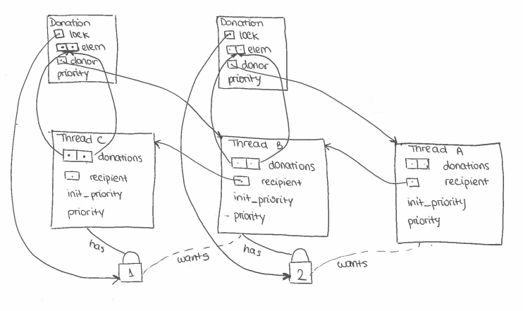

<h1 align="center" style="white-space:pre">
OS 211 
TASK 1: SCHEDULING 
DESIGN DOCUMENT 
</h1>


Pintos Group 13
===

* George Soteriou <gs2617@ic.ac.uk> 
* Niranjan Bhat   <nb1317@ic.ac.uk>
* Maria Teguiani  <mt5217@ic.ac.uk> 
* Iulia Ivana     <imi17@ic.ac.uk>

PRELIMINARIES
---
>MAYBE TODO

PRIORITY SCHEDULING
---

### DATA STRUCTURES

> A1: (2 marks)
> 
> Copy here the declaration of each new or changed 'struct' or 'struct' member, global or static variable, 'typedef', or enumeration.
> Identify the purpose of each in roughly 25 words.

```
<<<<<< sync.h >>>>>>
[1] struct donation
    {
[2]   struct lock *lock; 
[3]   int priority;                     
[4]   struct list_elem elem;           
[5]   struct thread *donor;         
    };
```

`[1]` An element held in each thread's list of donations to keep track of the threads that donated to it.  
`[2]` The lock that the donor is waiting for to be released.      
`[3]` An integer that stores the priority that got donated to the thread. We keep track of this to fall back to this priority in case of multiple donations.   
`[4]` Element used to the order this struct in the donations list of the thread (struct list donations)  
`[5]` A pointer to the donor thread (thread that donated to you)

```
<<<<<< thread.h >>>>>>
    struct thread
    {
      .... << same as before >>
[1]   int init_priority;          
[2]   struct list donations;      
[3]   struct thread *recipient; 
    };
```
`[1]` When all donations are satisfied, this is the priority that the thread should fall back to (this is the native priority)   
`[2]` A list of donation structs to keep track of threads that donated to this thread  
`[3]` A pointer to the thread it donated to because it is holding a lock that that this thread requires (If this is not NULL then the thread is blocked, as is is expecting a lock to be released by another thread) This is used in nested donations.

> A2: (4 marks) 
> 
> Draw a diagram that illustrates a nested donation in your structure and briefly explain how this works.

  

Suppose we have threads A, B and C with priorities in descending order. Assume there are disjoint arbitrary resources which threads B and C have a lock over. 

At any point in time, if thread B wishes to take control of the resources thread C has a lock over, under the standard priority donation procedure, thread B donates its priority to thread C. 

Following this, prior to thread C releasing the lock, if thread A wishes to take control of the resources thread B holds a lock over, it donates its priority to thread B as expected. However, as thread B donated its priority to thread C, and now holds the priority of thread A, it "updates" its donation to give thread C the new higher priority it received from thread A. 

At this stage, both threads A and B are blocked, with thread C having a nested donation. When thread C's process runs to completion, it releases its lock, and changes its priority to its initial value as the donation list is now empty. This causes thread B to release its lock as it has now acquired the resources it needed from thread C, which in turn causes thread B to revert back to its initial priority thereby unblocking thread A and giving control back to it. 

### ALGORITHMS

> A3: (3 marks) 
> 
> How do you ensure that the highest priority waiting thread wakes up first for a (i) lock, (ii) semaphore, or (iii) condition variable?

(i) Locks implement semaphores, which handle waking up threads by waking up the thread with the highest priority. This is implemented by sorting the list of waiters beforehand.
(ii) Semaphores have a list of waiters. We handle waking up the thread with the highest priority by sorting the list of waiters before waking them up. We prevent race conditions by blocking interrupts before sorting the list.  
(iii) Condition variables have a list of semaphores. We look through all the semaphores to find the one with the highest thread priority, and call sema_up on that semaphore, which in turn causes the highest priority thread to wake up.

> A4: (3 marks)
> 
> Describe the sequence of events when a call to lock_acquire() causes a priority donation. How is nested donation handled?

* If the lock requested has a holder then create a new donation struct populated with the required fields 
add it to the lock's holder's donations list. Then it will call update priority on the holder that will set its priority to the highest priortity between its own and the highest donation in the donations list. This function will also handle nested donations as it will check if the recipient field of the thread is not NULL. If so, it will recursively call the function on the recipient thread. 
* If there is no lock holder, it will just set the lock's holder to itself.
* Regardless, it will call sema down.

When lock acquire is called   
> A5: (3 marks)
> 
> Describe the sequence of events when lock_release() is called on a lock that a higher-priority thread is waiting for.
 
* When the lock is released, the function donation_list_filter is called. This will remove all the relations related to the lock that is being released, and it will also set the donor thread's recipient field to NULL.
* If there are no more donations in the list, then the priority is set to the initial priority.
* Otherwise, update_priority is called on the current thread, which will set its priority to the highest priortity between its own and the highest donation in the donations list.
* Finally, the lock holder is set to NULL, and the semaphore is upped.

### SYNCHRONIZATION

> A6: (2 marks)
> 
> How do you avoid a race condition in thread_set_priority() when a 
> thread needs to recompute its effective priority, but the donated
> priorities potentially change during the computation?
> Can you use a lock to avoid the race?

* We avoid race conditions by disabling interrupts before calculating the effective priority of the current thread.
* We could use a lock by creating a struct that holds a list and a lock, but we decided that this would create uneccessary overhead to work with.

### RATIONALE

> A7: (2 marks)
> 
> Why did you choose this design?  
> In what ways is it superior to another design you considered?

* We initially considered having the ready_list implemented as an array holding 64 queues, one for each priority level, as the manual suggested. We compared this design to having a single list of threads, ordered by priority. 
* For the ordered list, the complexity of insertion is O(n), and picking the highest priority thread is O(1), since it's always the first element of the list.
* For the array of queues, the complexity of insertion is O(1), but picking the highest priority thread is O(n), because you have to traverse the array until you find a non-empty list.
* Since more look-ups happen than insertions, we decided that the ordered list is the better design.
* We wanted to have a "contract" between the donor and the recipient thread. This was acheieved by adding a list of donation structs and a recipient pointer in the thread struct. This would help us keep track of "active contracts", and once they are resolved, the "contract" is deleted.

ADVANCED SCHEDULER
---

### DATA STRUCTURES

> B1: (2 marks)
> 
> Copy here the declaration of each new or changed 'struct' or
> 'struct' member, global or static variable, 'typedef', or
> enumeration.  Identify the purpose of each in roughly 25 words.

```
<<<<<<< init.h >>>>>>>
[1] extern bool boot_complete;  
     

<<<<<< thread.h >>>>>>
    struct thread
    {
      .... << same as before >>
[2]   int nice;          
[3]   int32_t recent_cpu;      
    };

<<<<<< thread.c >>>>>>
[4] static int32_t load_avg;
```
`[1]` Boolean value that is set to true after PintOS has booted. We use this value to ensure that we start updating load average only after a successful and complete boot.  
`[2]` The niceness value of the thread.   
`[3]` A measure of how much CPU time this thread has received 'recently'.
`[4]` A constantly changing value representing the average number of threads ready to run.

### ALGORITHMS

> B2: (3 marks)
> 
> Suppose threads A, B, and C have nice values 0, 1, and 2.  Each
> has a recent_cpu value of 0.  Fill in the table below showing the
> scheduling decision and the priority and recent_cpu values for each
> thread after each given number of timer ticks:

|timer<br>ticks|recent_cpu<br>A|recent_cpu<br>B|recent_cpu<br>C | priority<br>A|priority<br>B|priority<br>C|thread<br>to run|
|:-:|:----:|:----:|:----:|:----:|:----:|:----:|:---:|
| 0 |  0   |  0   |  0   |  63  |  62  |  62  |  A  |
| 4 |  4   |  0   |  0   |  62  |  62  |  62  |  A  |
| 8 |  8   |  0   |  0   |  61  |  62  |  62  |  B  |
|12 |  8   |  4   |  0   |  61  |  61  |  62  |  C  |
|16 |  8   |  4   |  4   |  61  |  61  |  61  |  A  |
|20 |  12  |  4   |  4   |  60  |  61  |  61  |  B  |
|24 |  12  |  8   |  4   |  60  |  60  |  61  |  C  |
|28 |  12  |  8   |  8   |  60  |  60  |  60  |  A  |
|32 |  16  |  8   |  8   |  59  |  60  |  60  |  B  |
|36 |  16  |  12  |  8   |  59  |  59  |  60  |  C  |

> B3: (2 marks) 
> 
> Did any ambiguities in the scheduler specification make values in 
> the table uncertain? If so, what rule did you use to resolve them?

* When the highest priority thread drops to the second highest priority, the specification is vague as to which thread should run. In our code, we yield every time the priority is updated, so we used this rule to complete the table.


> B4: (2 marks)
> 
> How is the way you divided the cost of scheduling between code
> inside and outside interrupt context likely to affect performance?


---- RATIONALE ----

> B5: (2 marks)
> 
> Briefly critique your design, pointing out advantages and
> disadvantages in your design choices.

* An advantage is that for the fixed point arithmetic we used inline functions instead of normal functions, which should eliminate the latency added due to function calls. However, this is guaranteed to always happen like it would with macros, as inline functions calling other inline fucntions may not be expanded inline.


